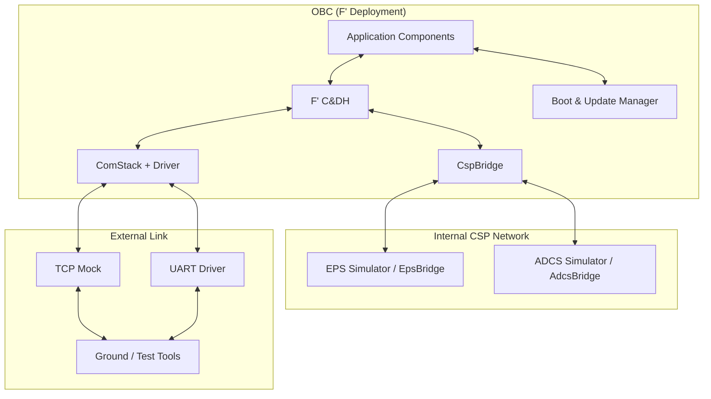

# CubeSat OBC FSW 設計規格總覽

> 本文件集為 **第一版正式規格基準**。本版不保留修訂紀錄；未來版本若有調整，再新增「修訂決策紀錄」。

## 1. 文件定位

| 項目 | 內容 |
|------|------|
| 專案名稱 | CubeSat OBC Flight Software |
| 文件性質 | 設計規格完整版 |
| 唯一事實來源 | F' 官方文件 v4.1.0 與本文件集 |
| 開發模式 | macOS（純軟體驗證） |
| 整合 / 目標運行模式 | Raspberry Pi 3B+（Linux） |
| 模擬器運行位置 | macOS 為主，可移轉至 Linux |
| 文件語言 | 繁體中文；程式碼 / 命令 / 專有名詞保留英文 |

## 2. 專案目標

本專案的第一版目標是建立一套可在 F' v4.1.0 上運作的 CubeSat OBC Flight Software 規格，涵蓋：

1. 以 F' 標準 C&DH 能力作為核心骨架。
2. 使用 libcsp 建立 OBC 與外部模擬子系統之間的內部通訊。
3. 建立 EPS 與 ADCS 的獨立模擬器，以及 OBC 側的 Bridge 元件。
4. 建立可在開發模式與 Raspberry Pi 目標模式之間切換的外部通訊架構。
5. 建立 Linux / Raspberry Pi 導向的 A/B Update 與回滾設計。
6. 建立後續可直接交由規格導向工具與 agent 使用的穩定文件基準。

## 3. 明確排除項目

以下內容 **不屬於第一版主規格**：

- STM32 / MCU raw flash 位址配置
- MCU 專用 SRAM / DTCM / linker script 設計
- 已定案的 CAN flight bus 規格
- 已定案的真實 radio vendor 協定細節
- 需要實體線材才可完成的硬體驗證流程

若未來需要移植至 MCU 或改用其他硬體平台，應另立「硬體移植附錄」處理，不回寫污染本版主體規格。

## 4. 系統模式

### 4.1 模式 A：macOS 純軟體驗證

- F' 主程式運行於 macOS
- EPS / ADCS 模擬器運行於 macOS
- 內部 CSP transport 使用 ZMQ
- 外部通訊鏈路以 TCP mock 驗證
- 無需外接硬體

### 4.2 模式 B：Raspberry Pi 3B+ 目標運行

- F' 主程式運行於 Raspberry Pi 3B+
- EPS / ADCS 模擬器可在 macOS 或 Linux 遠端運行
- 內部 CSP transport 第一版仍以 ZMQ 為主
- 外部通訊鏈路可切換為 UART-based driver
- 實體 radio 與 GPIO / I2C 驗證屬後續硬體階段

> 設計原則：兩種模式應盡量透過 **profile / configuration** 切換，而非維護兩套邏輯分叉實作。

## 5. 通訊分層策略

### 5.1 內部子系統網路（OBC ↔ EPS / ADCS）

| 項目 | 第一版定義 |
|------|-----------|
| 協定 | CSP |
| transport | ZMQ |
| 節點 | OBC Node 1、EPS Node 2、ADCS Node 3 |
| 未來擴充 | 可另增 CAN profile，但不視為第一版必用 |

### 5.2 外部通訊鏈路（OBC ↔ Radio / GND mock）

| 階段 | 方案 |
|------|------|
| 開發期 | `Drv::TcpClient` / TCP mock |
| 目標整合期 | `UartDriver` |
| 未來實體 radio 適配 | UART/KISS 或 transparent UART，依 radio 協定再定 |

## 6. 高階架構

## 7. 目錄與子文件索引

| # | 文件 | 用途 |
|---|------|------|
| 00 | [00_dev_spec_main.md](./00_dev_spec_main.md) | 本文件，總覽與基準 |
| 01 | [01_project_setup.md](./01_project_setup.md) | 專案建立、F' 初始化、profile 與 libcsp 整合 |
| 02 | [02_command_telemetry_design.md](./02_command_telemetry_design.md) | 指令、遙測、事件與型別規格 |
| 03 | [03_memory_resource_design.md](./03_memory_resource_design.md) | Linux / RPi 資源、記憶體、儲存與 OTA 空間規格 |
| 04 | [04_eps_simulator.md](./04_eps_simulator.md) | EPS 模擬器與 `EpsBridge` 規格 |
| 05 | [05_adcs_simulator.md](./05_adcs_simulator.md) | ADCS 模擬器與 `AdcsBridge` 規格 |
| 06 | [06_comm_subsystem.md](./06_comm_subsystem.md) | 通訊次系統、`UartDriver`、`RadioController`、`CommController` |
| 07 | [07_boot_update_manager.md](./07_boot_update_manager.md) | A/B Update、確認與回滾規格 |
| 08 | [08_testing_verification.md](./08_testing_verification.md) | 測試分層、驗收準則、CI 與 `Blocked-HW` 規則 |
| 09 | [09_git_workflow.md](./09_git_workflow.md) | Git / GitHub private repo / tag / CI 工作流 |
| 10 | [10_test_record_guide.md](./10_test_record_guide.md) | 測試紀錄模板與人工檢查指引 |
| A1 | [start-gds.md](./start-gds.md) | GDS 與背景程序啟動指引 |
| A2 | [agent_instruction_skill_change_notes.md](./agent_instruction_skill_change_notes.md) | root agent / instruction / skill 調整說明 |
| A3 | [consistency_check_report.md](./consistency_check_report.md) | 重構後一致性檢查報告 |

## 8. 命名與基準規則

### 8.1 元件與 instance

- F' 元件名稱使用 PascalCase，例如 `CspBridge`、`EpsBridge`、`BootManager`
- 通用元件以 family 命名，例如 `UartDriver`、`RadioController`
- 多 instance 以功能與頻段命名，例如 `sbandUart`、`uhfCtrl`

### 8.2 提交與版本

- commit 規則以 [09_git_workflow.md](./09_git_workflow.md) 與根目錄 `SKILL.md` 為準
- release tag 採：`v0.1.0` ～ `v0.6.0`，以及 `v1.0.0`
- 本版文件不在章節中維護版本歷程

### 8.3 驗證標記

- 可執行驗證：列為正式驗收條件
- 因硬體缺失無法執行：標記 `Blocked-HW`
- `Blocked-HW` 項目必須附替代驗證證據

## 9. 第一版一致性基準

以下敘述應在所有子文件中保持一致：

1. 第一版飛行平台為 Raspberry Pi 3B+ / Linux。
2. 不保留 STM32 與 raw flash 設計內容。
3. 內部 CSP 網路第一版以 ZMQ 為主。
4. 外部通訊鏈路第一版開發期採 TCP mock，目標整合期可切換 UART。
5. Boot 更新流程不透過 command payload 搬運大檔。
6. 韌體映像應先經 file uplink 或 staging file，再由 `BootManager` 控制驗證與切換。
7. 測試與 CI 必須納入人工可審查的測試紀錄。

## 10. 閱讀建議順序

1. [01_project_setup.md](./01_project_setup.md)
2. [02_command_telemetry_design.md](./02_command_telemetry_design.md)
3. [03_memory_resource_design.md](./03_memory_resource_design.md)
4. [04_eps_simulator.md](./04_eps_simulator.md)
5. [05_adcs_simulator.md](./05_adcs_simulator.md)
6. [06_comm_subsystem.md](./06_comm_subsystem.md)
7. [07_boot_update_manager.md](./07_boot_update_manager.md)
8. [08_testing_verification.md](./08_testing_verification.md)
9. [10_test_record_guide.md](./10_test_record_guide.md)
10. [09_git_workflow.md](./09_git_workflow.md)
