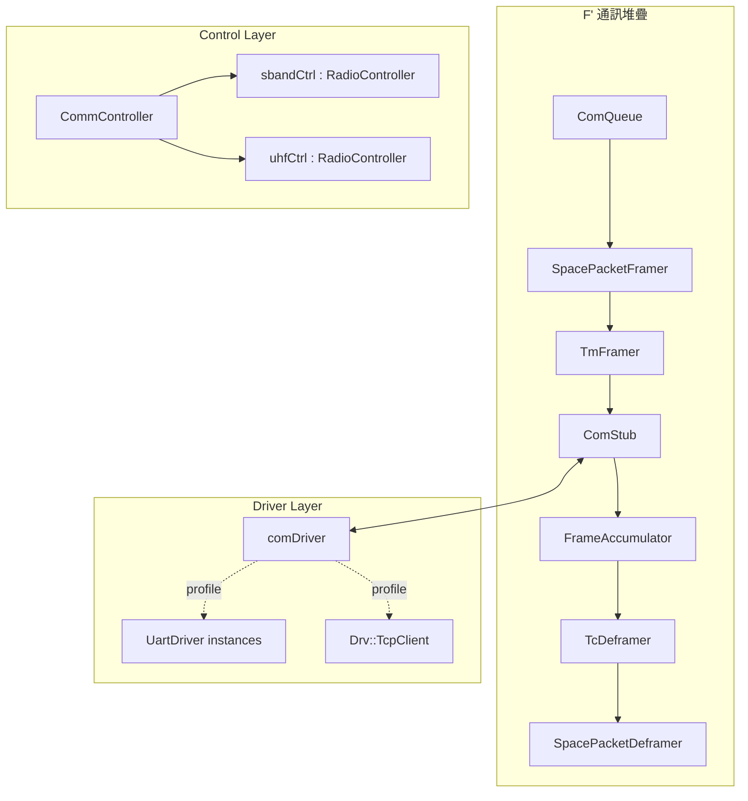

# 06 — 通訊次系統規格

## 1. 文件目的

本文件定義第一版 OBC 外部通訊鏈路的設計方式，重點包括：

- `CommController`
- `UartDriver` family
- `RadioController` family
- 開發模式與目標模式之間的切換策略
- 真實 hardware 驗證尚未可執行時的替代驗證方式

## 2. 分層原則

### 2.1 內部網路與外部鏈路分離

本章只處理 **外部通訊鏈路**。下列內容 **不在本章定義範圍**：

- OBC ↔ EPS / ADCS 的內部 CSP transport
- CAN bus first-version 內部節點互連

內部子系統網路已在 [00_dev_spec_main.md](./00_dev_spec_main.md) 與 [01_project_setup.md](./01_project_setup.md) 定義為 ZMQ。

### 2.2 外部鏈路第一版策略

| 階段 | transport | 說明 |
|------|-----------|------|
| 開發期 | TCP mock | 使用 F' 既有 `Drv::TcpClient` 驗證完整收發路徑 |
| 目標整合期 | UART | 使用通用 `UartDriver` |
| 未來擴充 | UART/KISS 或 vendor-specific adapter | 視真實 radio 協定而定 |

## 3. 設計目標

1. 不改動 F' 既有 ComStack 的核心資料流。
2. 將 transport 差異限制在 driver 層。
3. `UartDriver` 與 `RadioController` 只實作一次，以多 instance 重用。
4. 在無實體線材條件下，仍可用 TCP mock 與 PTY 模擬完成主要驗證。

## 4. 高階架構



## 5. `CommController` 規格

### 5.1 職責

- 管理活動頻段（S-Band / UHF）
- 管理通訊窗口開始 / 結束
- 將 band-selection 與 radio enable 狀態整理為可觀測遙測

### 5.2 不負責事項

- 不直接負責 byte stream 讀寫
- 不直接解析 radio vendor 協定
- 不直接處理 CSP 內部網路封包

## 6. `UartDriver` family 規格

### 6.1 設計原則

- 提供與 `Drv::ByteStreamDriverModel` 相容的界面
- 使用同一個元件家族支援不同頻段
- 差異僅在 instance 設定，例如：device path、baud rate、可能的 line discipline

### 6.2 instance 範例

```fpp
instance sbandUart: OBC.UartDriver base id 0x10055000
instance uhfUart:   OBC.UartDriver base id 0x10056000
```

### 6.3 設定差異

| 參數 | `sbandUart` | `uhfUart` |
|------|-------------|-----------|
| Device | `/dev/ttyS1` 或 profile 指定 | `/dev/ttyS2` 或 profile 指定 |
| Baud rate | 依 radio 規格 | 依 radio 規格 |
| Framing | transparent / adapter-defined | transparent / adapter-defined |

> 第一版文件不強制指定固定 baud rate。若後續硬體規格明確，再將其列入 hardware profile。

## 7. `RadioController` family 規格

### 7.1 設計原則

- 提供 radio power / frequency / status 控制
- 使用一套 generic command 與 telemetry naming
- 由 instance 決定實際硬體語意

### 7.2 instance 範例

```fpp
instance sbandCtrl: OBC.RadioController base id 0x10057000
instance uhfCtrl:   OBC.RadioController base id 0x10058000
```

### 7.3 第一版實作範圍

| 項目 | 第一版要求 |
|------|-----------|
| `RADIO_ENABLE` | 必須 |
| `RADIO_SET_POWER` | 必須 |
| `RADIO_SET_FREQ` | 必須 |
| `RADIO_GET_STATUS` | 必須 |
| 真實 I2C / GPIO 通路 | 可 deferred，允許 mock |

## 8. KISS 與 transparent UART 立場

第一版不將 KISS 視為已定案必要實作，而採以下策略：

1. `UartDriver` 先提供 generic byte stream transport。
2. 若實體 radio 要求 KISS，則在 driver 上層或 adapter 層補入對應 framing。
3. 在未取得實體 radio 協定前，不預先把整體設計綁死在 KISS。

## 9. 驗證模式

### 9.1 開發驗證：TCP mock

- 使用 `Drv::TcpClient`
- 驗證 GDS 指令、遙測、事件與 file path 正常
- 不需外接硬體

### 9.2 PTY / 虛擬 UART 驗證

在 macOS 或 Linux 上可用 `socat` 建立 pseudo terminal pair：

```bash
socat -d -d pty,raw,echo=0 pty,raw,echo=0
```

用途：

- 將 `UartDriver` 接到一端 PTY
- 將測試工具或 mock radio 接到另一端 PTY
- 驗證 `UartDriver` 實作與錯誤恢復行為

### 9.3 真實硬體驗證

目前因缺少實體連接線與對應裝置，以下項目標記為 `Blocked-HW`：

- Raspberry Pi 3B+ ↔ macOS 實線 UART 驗證
- 真實 radio power / telemetry / GPIO / I2C 驗證

## 10. 故障與回退策略

| 狀況 | 行為 |
|------|------|
| `TcpClient` 不可用 | 記錄事件並保持 command path 可診斷 |
| `UartDriver` 開啟失敗 | 事件告警，driver 狀態標記 false |
| PTY / UART 中斷 | 記錄錯誤，允許重新連線 |
| radio 控制失敗 | 事件告警，不直接使整個 OBC 崩潰 |

## 11. 驗收準則

| 編號 | 驗收項目 | 通過條件 |
|------|---------|---------|
| 1 | 分層清楚 | 外部鏈路與內部 CSP 網路不混寫 |
| 2 | transport 可切換 | TCP mock 與 UART driver 以 profile / instance 切換 |
| 3 | generic family 一致 | `UartDriver` / `RadioController` 採多 instance 重用 |
| 4 | KISS 立場清楚 | 未被誤寫為第一版強制方案 |
| 5 | `Blocked-HW` 明確 | 真實硬體驗證未被寫成現況必過條件 |
