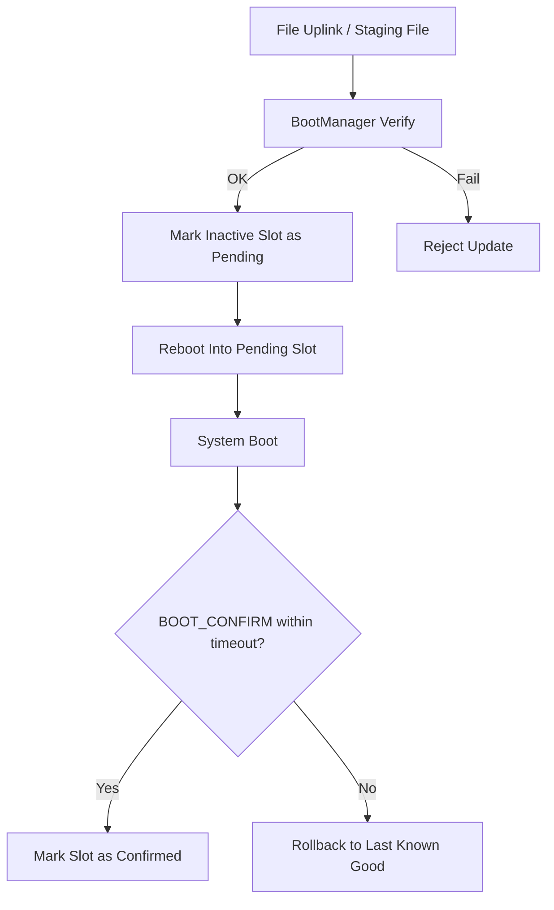

# 07 — Boot & Update Manager 規格

## 1. 文件目的

本文件定義第一版 CubeSat OBC FSW 在 **Linux / Raspberry Pi 3B+** 平台上的 A/B 更新、確認與回滾策略。

> 本文件聚焦於 **應用層與系統層的 Boot & Update 管理邏輯**，不是 MCU raw flash bootloader 規格。

## 2. 設計目標

1. 支援 A/B slot 形式的安全更新。
2. 更新時不覆蓋目前正在運行的 slot。
3. 啟動後必須透過 `BOOT_CONFIRM` 完成確認。
4. 若新版本未在期限內確認，必須可回滾到前一個已知穩定 slot。
5. 更新映像透過 file uplink 或 staging file 傳入，不走 command chunk upload。

## 3. 系統邊界

### 3.1 本文件涵蓋

- `BootManager` F' 元件介面
- staging file 驗證流程
- slot metadata
- activate / confirm / rollback 策略

### 3.2 本文件不涵蓋

- Raspberry Pi 底層 ROM / firmware bootloader 細節
- Linux 發行版特定 bootloader 寫法
- 真實安全晶片與 secure boot chain

## 4. 高階架構

## 5. Slot 與儲存模型

### 5.1 邏輯角色

| 項目 | 說明 |
|------|------|
| Slot A | 已知穩定版本或待切換版本 |
| Slot B | 已知穩定版本或待切換版本 |
| Staging Area | 上傳完成後待驗證映像 |
| Metadata Store | 保存 active / pending / confirmed 狀態 |

### 5.2 Metadata 欄位

第一版至少需要：

- `active_slot`
- `pending_slot`
- `last_known_good_slot`
- `confirmed`
- `expected_digest`
- `last_boot_attempt_time`
- `last_error_code`

## 6. 更新資料路徑

### 6.1 第一版正式路徑

1. 地面端使用 F' file uplink 或等價工具將映像放入 staging area。
2. `BOOT_PREPARE_UPDATE` 登錄映像大小與 digest。
3. `BOOT_VERIFY_STAGED_IMAGE` 對 staging file 進行驗證。
4. 驗證成功後，以 `BOOT_ACTIVATE_STAGED_IMAGE` 設定下次啟動 slot。
5. 重啟進入 pending slot。
6. 新版本於確認期限內送出 `BOOT_CONFIRM`。
7. 若未確認，系統在下一次啟動時回滾。

### 6.2 明確禁止

以下設計 **不得出現在第一版**：

- `BOOT_WRITE_CHUNK(offset, data)`
- 以 command payload 傳整個 binary chunk
- 以 raw flash address 當作應用層介面參數

## 7. `BootManager` 元件規格

### 7.1 指令

| 指令名稱 | 說明 |
|---------|------|
| `BOOT_STATUS` | 查詢 active / pending / confirmed 狀態 |
| `BOOT_PREPARE_UPDATE` | 登錄待驗證映像 metadata |
| `BOOT_VERIFY_STAGED_IMAGE` | 驗證 staging file |
| `BOOT_ACTIVATE_STAGED_IMAGE` | 將已驗證映像設為下次啟動目標 |
| `BOOT_CONFIRM` | 啟動後確認當前版本正常 |
| `BOOT_ROLLBACK` | 主動回滾到已知穩定版本 |

### 7.2 遙測

| 遙測 | 說明 |
|------|------|
| `BOOT_ACTIVE_SLOT` | 當前 slot |
| `BOOT_PENDING_SLOT` | 待切換 slot |
| `BOOT_CONFIRMED` | 目前版本是否已確認 |
| `BOOT_UPDATE_PROGRESS` | 驗證 / 啟動流程進度 |
| `BOOT_LAST_ERROR` | 最近錯誤代碼 |

### 7.3 事件

| 事件 | 說明 |
|------|------|
| `BOOT_UPDATE_PREPARED` | metadata 已登錄 |
| `BOOT_STAGE_VERIFY_OK` | 驗證成功 |
| `BOOT_STAGE_VERIFY_FAIL` | 驗證失敗 |
| `BOOT_SLOT_SWITCHED` | 下次啟動目標已切換 |
| `BOOT_CONFIRMED` | 版本已被確認 |
| `BOOT_ROLLBACK_TRIGGERED` | 已觸發回滾 |

## 8. 確認與回滾策略

### 8.1 確認條件

- 新版本啟動後，在指定 timeout 內必須送出 `BOOT_CONFIRM`
- timeout 建議值：30 秒至 180 秒，依 deployment 初始化時間調整
- timeout 期間可搭配 health check 或 watchdog 作為補充判定

### 8.2 回滾條件

任一條件成立即可回滾：

- 新版本未在 timeout 內確認
- 啟動後健康檢查連續失敗
- `BootManager` 判定 metadata 損毀或 slot 驗證失效
- 操作人員手動送出 `BOOT_ROLLBACK`

## 9. 驗證與安全性邊界

### 9.1 第一版必做

- 映像 digest 驗證
- slot 狀態切換一致性檢查
- 確認 / 回滾流程驗證
- metadata 損毀情境的保守處理

### 9.2 第一版可延後

| 項目 | 狀態 |
|------|------|
| 簽章驗證 | 建議預留介面，可 deferred |
| secure boot | 不列為第一版完成條件 |
| 雙系統分區實機量測 | `Blocked-HW` / `Deferred-RPi` |

## 10. 驗證策略

### 10.1 可在現況完成的驗證

| 驗證項目 | 方法 |
|---------|------|
| staging verify | 使用假映像檔與 digest 驗證 |
| activate / confirm | 模擬切換 metadata 與啟動狀態 |
| rollback | 模擬未確認 timeout 或健康檢查失敗 |
| F' 遙測 / 事件 | 使用 GDS 或 script 驗證 |

### 10.2 不可在現況完成的驗證

| 項目 | 狀態 |
|------|------|
| 真實 Raspberry Pi 啟動鏈整合 | `Deferred-RPi` |
| 真實 SD card A/B 切換與斷電測試 | `Blocked-HW` |

## 11. 驗收準則

| 編號 | 驗收項目 | 通過條件 |
|------|---------|---------|
| 1 | Linux 導向一致 | 不含 raw flash / MCU bootloader 描述 |
| 2 | 更新路徑一致 | 映像經 staging file 驗證，不走 chunk command |
| 3 | A/B 策略清楚 | 有 active / pending / last-known-good 定義 |
| 4 | confirm / rollback 完整 | 可描述成功與失敗兩條路徑 |
| 5 | 測試限制透明 | `Blocked-HW` / `Deferred-RPi` 已標記 |
