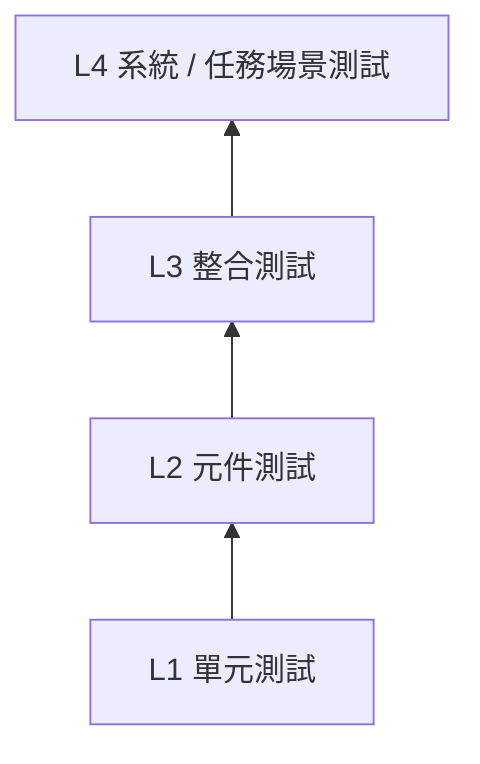

# 08 — 測試與驗證策略

## 1. 文件目的

本文件定義第一版 OBC 規格的測試分層、驗收規則、CI 最小要求與 `Blocked-HW` 標記方式。

> 所有人工測試都必須搭配 [10_test_record_guide.md](./10_test_record_guide.md) 產出測試紀錄。

## 2. 測試分層



| 層級 | 範圍 | 工具 | 頻率 |
|------|------|------|------|
| L1 | 單一函式 / 模型 | Google Test / 自訂 UT | 每次主要修改 |
| L2 | 單一 F' 元件 | F' TesterBase + GTest | 每次主要修改 |
| L3 | 多元件 + simulator | GDS、scripts、CSP test nodes | 每次整合前 |
| L4 | 全系統情境 | GDS + 多節點 + 測試紀錄 | 每個主要里程碑 |

## 3. `Blocked-HW` 規則

### 3.1 可標記情境

當測試需依賴以下條件且現況無法提供時，可標記 `Blocked-HW`：

- Raspberry Pi 3B+ 與開發機之間的實線 UART
- 真實 radio 硬體
- 真實 GPIO / I2C
- 真實 SD card A/B 啟動鏈驗證

### 3.2 必備補件

每個 `Blocked-HW` 測試都必須附：

1. 原本測試目的
2. 為何被阻塞
3. 替代驗證方式
4. 摘要結果
5. 後續解除條件

### 3.3 `Blocked-HW` 紀錄模板

```text
Blocked-HW Test ID:
原始測試目的:
阻塞原因:
替代證據（log/模擬結果/腳本輸出）:
實際摘要結果:
解除條件（何時可回到真機測試）:
```

## 4. L1 — 單元測試

### 4.1 物理模型

- Battery model：SoC、電壓、溫度界限
- Solar model：日照 / 日蝕切換
- ADCS dynamics：四元數範數、角速度收斂
- CRC / digest utilities：已知測試向量

### 4.2 Boot / Update utilities

- metadata parse / serialize
- digest verify
- slot selection policy
- rollback condition policy

## 5. L2 — 元件測試

### 5.1 必測元件

| 元件 | 主要測試點 |
|------|-----------|
| `CspBridge` | init、ping、timeout、buffer 統計 |
| `EpsBridge` | 狀態解析、低電量事件、fallback |
| `AdcsBridge` | 姿態解析、模式切換、fault event |
| `CommController` | band switch、pass window 狀態 |
| `BootManager` | prepare、verify、activate、confirm、rollback |

### 5.2 驗證原則

- 事件參數必須可驗證
- 遙測更新必須可驗證
- 錯誤處理與 timeout path 必須至少各有一個測試

## 6. L3 — 整合測試

### 6.1 Phase 1 / 基礎整合

- ZMQ proxy + echo node + OBC + GDS
- 驗證 `CSP_INIT`、`CSP_PING`
- 驗證 GDS 可看到基本 telemetry / event

### 6.2 Phase 3 / EPS 整合

- 啟動 EPS simulator + OBC
- 確認 `EPS_VBAT` / `EPS_SOC` 可見
- 觸發 `EPS_SET_PDU` 並確認狀態改變
- 模擬 SoC 下降至低電量閾值

### 6.3 Phase 4 / ADCS 整合

- 啟動 ADCS simulator + OBC
- 驗證 `ADCS_SET_MODE(DETUMBLE)`
- 觀察 `ADCS_OMEGA_*` 下降趨勢
- 驗證 `ADCS_POINTING_ERR` 可更新

### 6.4 Phase 5 / 通訊整合

- TCP mock 路徑必測
- PTY / `socat` 模擬 UART 路徑必測
- 驗證 `COMM_SET_ACTIVE` 與 `RADIO_ENABLE`
- 若無硬體，真實 UART 標記 `Blocked-HW`

### 6.5 Phase 6 / Update 整合

- 準備假映像至 staging area
- `BOOT_PREPARE_UPDATE`
- `BOOT_VERIFY_STAGED_IMAGE`
- `BOOT_ACTIVATE_STAGED_IMAGE`
- 模擬 reboot 後 `BOOT_CONFIRM`
- 模擬 timeout 以觸發 rollback

## 7. L4 — 系統場景測試

### 7.1 標準任務模擬

建議場景：

1. 系統啟動，進入 `SAFE`
2. `BOOT_CONFIRM`
3. 切換 `NOMINAL`
4. `CSP_PING` 確認 EPS / ADCS 存活
5. 進行 ADCS 去翻滾
6. 開啟通訊窗口
7. 模擬日蝕導致電量下降
8. 視條件切換 `LOW_POWER`

### 7.2 更新與回滾

1. 上傳測試映像至 staging area
2. 驗證成功後啟用
3. 模擬重啟進入新 slot
4. 不送 `BOOT_CONFIRM`
5. 驗證回滾到 last known good slot

### 7.3 通訊異常恢復

1. 正常收發
2. 中斷 TCP 或 PTY / UART
3. 確認事件告警
4. 恢復鏈路
5. 確認系統可恢復 telemetry / command path

## 8. CI 最小必跑項目

第一版 CI 最小集：

1. build
2. unit / component tests
3. 基本整合測試（可模擬）

### 8.3 Bootstrap 階段最低 gate

- 在專案 bootstrap 階段，至少必須驗證 `generate` 與 `build`。
- 若尚未進入元件測試開發，允許暫以 bootstrap build 記錄作為前期 gate 證據。
- 進入元件實作後，需回到 build + unit/component tests 的完整 gate。

### 8.2 baseline gate 判定規則

- PR 合併前至少需通過 `build` 與 `unit/component tests`。
- 若變更觸及整合行為，需附上 L3 semi-automated 或人工紀錄。
- 硬體受限測試不得省略，需改以 `Blocked-HW` 格式附替代證據。

### 8.1 不要求在 CI 必跑的項目

- 真實 Raspberry Pi 硬體測試
- 真實 UART / GPIO / I2C 測試
- 長時間 mission soak test

## 9. 測試證據要求

### 9.1 自動化測試

需保存：

- 測試名稱
- 執行時間
- pass / fail
- 簡要錯誤摘要

### 9.2 人工測試

需保存：

- 測試步驟
- 使用指令
- 預期結果
- 實際摘要結果
- 是否 `Blocked-HW`

詳細格式見 [10_test_record_guide.md](./10_test_record_guide.md)。

## 10. 與 GDS 相關的測試原則

- GDS 可用於人工驗證 command / telemetry / event path
- 若使用 CLI / test API，自動化腳本應記錄輸入 command 與結果摘要
- 不要求在紀錄中貼上所有原始 log，只需保留足夠摘要證據

## 11. 驗收準則

| 編號 | 驗收項目 | 通過條件 |
|------|---------|---------|
| 1 | 測試分層完整 | L1~L4 各自角色清楚 |
| 2 | `Blocked-HW` 規則完整 | 有標記條件與替代證據要求 |
| 3 | CI 最小集一致 | build / unit / component / 基本整合測試明確 |
| 4 | 測試紀錄納入必要產出 | 明確引用 [10_test_record_guide.md](./10_test_record_guide.md) |
| 5 | 與其餘章節一致 | Boot 更新、通訊、模擬器驗證名稱一致 |
